# Dog Dojo
Milestone Project 1 - Alice Phipps

[Github link](https://github.com/AP071216/mp1)

## Dog Dojo

This project designs and produces a website for a dog training business that provides information on the trainers, classes and events offered and opportunity to book with and contact the business. The website uses a simple colour pallete based on teal and coral which provide a clean appearance whilst also promoting a fun aspect. The fonts are simple and easy to read to not distract from the content.

### About Dog Dojo

"Dog Dojo" is a dog training business in Cheshire created by a dog lover and trainer with the aim to share knowledge and endorse positive relationships between dogs and their owners. It offers a 6 week puppy course as well as 1-2-1 sessions for behavioural issues and extra training. The business also hosts regular and one off events.

They required a simple website with easy navigation with a page displaying what they offered as a business and easy methods of booking and contact.

## Table of Contents

1. [UX](#ux)
    - [User Stories](#user-stories)
    - [Dog Owners](#dog-owners)
2. [Design](#design)
    - [Colours](#colours)
    - [Fonts](#fonts)
    - [Icons](#icons)
3. [Wireframes](#wireframes)
    - [Homepage - Desktop](#homepage---desktop)
    - [Homepage - Mobile](#homepage---mobile)
    - [What we offer - Desktop](#what-we-offer-page---desktop)
    - [What we offer - Mobile](#what-we-offer-page---mobile)
4. [Deployment](#deployment)
    - [Repository](#repository)
    - [Hosting](#hosting)
5. [Features](#features)
    - [Navigation Menu](#navigation-menu)
    - [Carousel](#carousel)
    - [Curriculum](#curriculum)
    - [Booking form](#booking-form)
    - [Footer](#footer)
6. [Testing](#testing)
7. [Technologies Used](#technologies-used)
8. [Credits and References](#credits-and-references)
## UX

### User Stories

Primary goal of Dog Dojo is to provide a fun alternative to at home training and to improve socialisation of dogs in a safe and entertaining environment for both dogs and owners. Target audience is for owners of both puppies and dogs

### Dog owners

As a dog owner, I want:
1. The ability to easily book onto training class, 1-2-1 session or event so I can enhance my knowledge of owning a dog 
2. To view a basic curriculum for the course so I can confirm it aligns with my personal goals
3. Photos from the course to get a good view of the venue and types of dogs that have enrolled previously 
4. Information on the trainers that run the courses and events so that I can be confident that I’m receiving the best possible training
5. A clear navigation system through the site with links 
6. A schedule of regular events and upcoming one-off events so I can view which I’d like to attend
7. A contact section to easily ask for advice on behavioural issues that don’t require a 1-2-1 session to correct

## Design

The website is comprised of 4 pages comprising of, Home, What we offer, Events, and Contact. This provides clear separation of information with an added "booking" link in the navbar for quick access to the booking form on the "what we offer" page. 

Each page has easy access back to the home page or another page the user finds important

### Colours

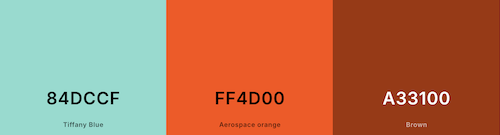

### Fonts

- Primary font “Comfortaa” is an easy to read font whilst giving a more unique feel for headings and key text
- Secondary font “Baloo Bhaijaan 2” is also easy to read and a slightly more compact nature for content whilst keeping things clear

### Icons

Icons chosen for their clear representative meaning replacing text for a more modern look

## Wireframes

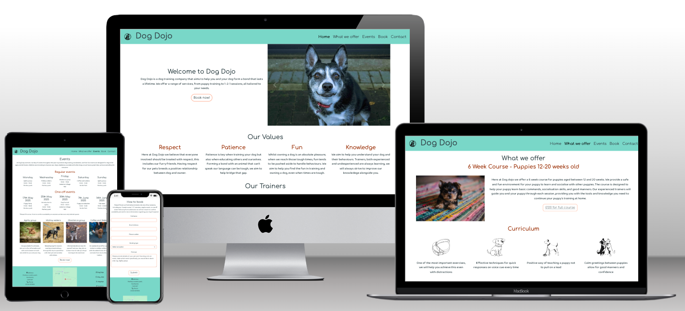

### Homepage - Desktop

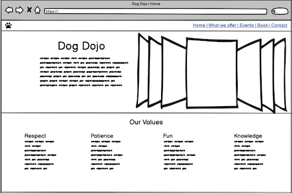

### Homepage - Mobile
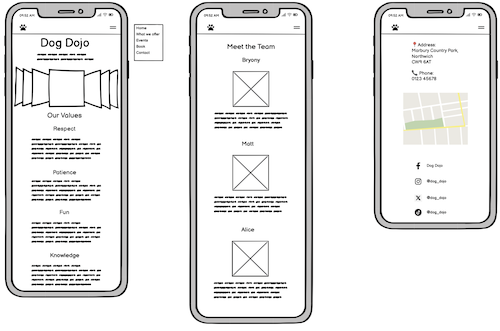

### What we offer page - Desktop
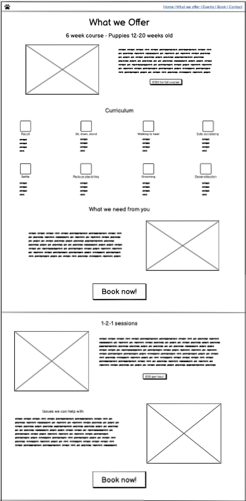 
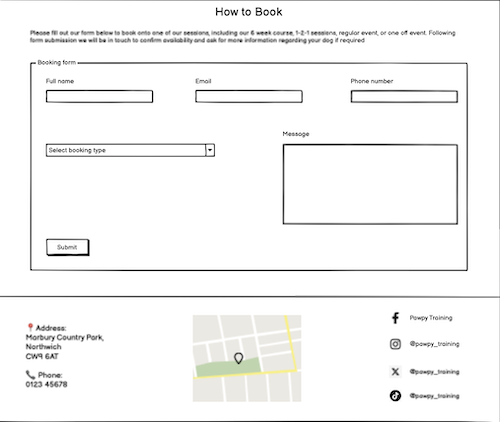

### What we offer page - Mobile

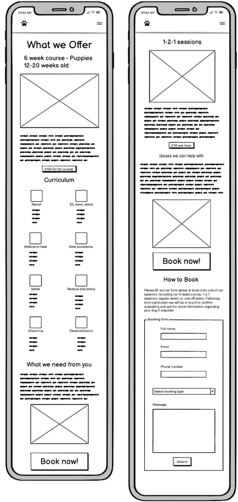

## Deployment

Github and Visual Studio are used to deploy the project

### Repository

1. Intially I created a public repository on my Github account and copied this to my repository on Visual Studio using the following commands
    - git config --global user.name (add username)
    - git config --global user.email (add email)
    - git config --list
2. Throughout my work on the project, I regularly committed my work to github using the following commands
    - git add .
    - git commit -m "Helpful and consise message regarding what had been changed"
3. After several commits were made, I then pushed my work to Github using:
    - git push

### Hosting
1. On conception of the project and having completed a basic boilerplate for my work, I went onto my project repository on github to set up for deployment
2. I went into Settings > Pages and ensured that "Deploy from a branch" was selected the main branch was the branch chosen then pressed save and waited for deployment

(Insert image of deployment)

## Features

Features used for an easy user experience and allowing information to be viewed easily and and accessibly.

### Navigation Menu

Navigation bar is only viewed from the top of the screen to avoid covering content during scrolling. Logo is always on the left hand side of the screen and the text Dog Dojo sits centrally on larger screens then sits to the left on smaller screens to adapt for dropdown menu

### Navbar - Mobile

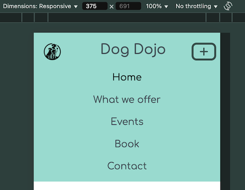

### Navbar - Desktop

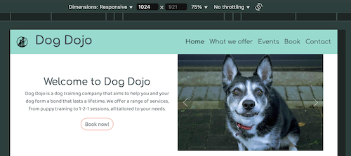

### Carousel

I included a carousel at the top of my homepage to provide a simple display of 3 images, I selected them due to their size regularity and display of various types of dogs

### Carousel - Desktop

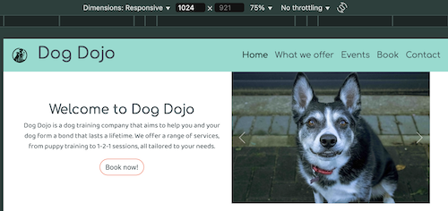

### Curriculum

I used images that were generated by AI in order to create small icon like images to provide additional media and to segment each part of the curriculum. On smaller devices the grid structure changes to allow all the icons to be viewed easily

### Curriculum - Desktop

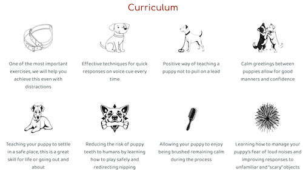

### Curriculum - Mobile

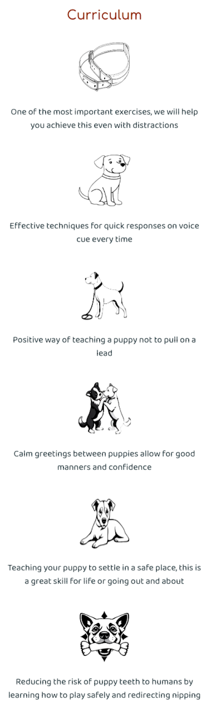

### Booking Form

At the bottom of the "What we offer" page I added a simple booking form, I also used this design on my contact page but replaced the drop down with radio buttons. I ensured this was responsive on all screen sizes and that all fields were marked as required to ensure no information could be missed out

### Footer

Inclusion of an image from Google Maps with a pin dropped onto the main location of the business so users can easily find them. I also included an address and business phone number as well as links to their social media pages. On smaller screen sizes this information is stacked on top of each other rather than lying side by side. Uses the same background colour as the navbar to stand out and for continuity

## Testing

### Browser Testing

Using "Browser Stack"

<table>
  <thead>
    <tr>
      <th>Browser</th>
      <th>Device/Operating system</th>
      <th>Appearance</th>
      <th>Responsiveness</th>
    </tr>
  </thead>
  <tbody>
    <tr>
      <td>Chrome</td>
      <td>Galaxy S24 and Windows 11</td>
      <td>All the pages format correctly. The links, nav and form all work as expected.</td>
      <td>Great</td>
    </tr>
    <tr>
       <td>Safari</td>
       <td>iPad 9th and Sequoia</td>
      <td>All the pages format correctly. The links, nav and form all work as expected.</td>
      <td>Great</td>
    </tr>
    <tr>
      <td>Edge</td>
      <td>Galaxy Z fold 6 and Windows 11</td>
      <td>All the pages format correctly. The links, nav and form all work as expected.</td>
      <td>Great</td>
    </tr>
 
  </tbody>
</table>

### Responsive testing

#### Min-width 320px

<table>
    <thead>
        <tr>
            <th>Navigation bar</th>
            <th>Images</th>
            <th>Text</th>
            <th>Grid system</th>
        </tr>
    </thead>
    <tbody>
        <tr>
            <td>Navigation bar has dropdown menu to account for less horizontal space, "Dog Dojo" text is centered due to extra space in the middle</td>
            <td>Some images increased in size to fill empty space but doesn't overflow and fits the page well</td>
            <td>Text aligned well, text isn't too large for the screensize. Forms fit well</td>
            <td>Due to the grid system, all content aligns on the page in one column and doesn't overlap</td>
        </tr>
    </tbody>
</table>

#### Min-width 425px

<table>
    <thead>
        <tr>
            <th>Navigation bar</th>
            <th>Images</th>
            <th>Text</th>
            <th>Grid system</th>
        </tr>
    </thead>
    <tbody>
        <tr>
            <td>Navigation bar has dropdown menu to account for less horizontal space, "Dog Dojo" text is centered due to extra space in the middle</td>
            <td>Some images increased in size to fill empty space but doesn't overflow and fits the page well. Carousel images increase size responsively to fit screensize</td>
            <td>Text aligned well, text isn't too large for the screensize. Forms fit well</td>
            <td>Due to the grid system, all content aligns on the page in one column and doesn't overlap</td>
        </tr>
    </tbody>
</table>

#### Min-width 768px

<table>
    <thead>
        <tr>
            <th>Navigation bar</th>
            <th>Images</th>
            <th>Text</th>
            <th>Grid system</th>
        </tr>
    </thead>
    <tbody>
        <tr>
            <td>Navigation bar still has dropdown menu to account for less horizontal space, "Dog Dojo" text is centered due to extra space in the middle but aligns well</td>
            <td>Images are correctly sized for the screen, some images increased from mobile size to better fit viewport, </td>
            <td>Text aligned well, text isn't too large for the screensize. Forms are viewable in the desktop format without compromising form space</td>
            <td>Due to the grid system, content can now fit into two columns across the screen, matching desktop view in most cases. Curriculum icons with text are aligned into 3 columns with 2 columns for the bottom row. Events page aligned into 2 columns with 1 column on the bottom row</td>
        </tr>
    </tbody>
</table>

#### Min-width 992px

<table>
    <thead>
        <tr>
            <th>Navigation bar</th>
            <th>Images</th>
            <th>Text</th>
            <th>Grid system</th>
        </tr>
    </thead>
    <tbody>
        <tr>
            <td>Navigation bar no longer has dropdown menu so links are displayed in a row along the top. "Dog Dojo" text aligns left to account for the used space on the right </td>
            <td>Carousel images at their largest whilst other images have been decreased in size to account for the grid system but are still easily viewed</td>
            <td>Text aligned well, fits the screen and doesn't overlap any other content. Form is at it's largest and has plenty of space to fill out correctly</td>
            <td>Grid system allows for easy view of content, mostly occupying 2 columns however events sections and curriculum are able to be up to 4-5 coluumns </td>
        </tr>
    </tbody>
</table>

### HTML Validator

Homepage

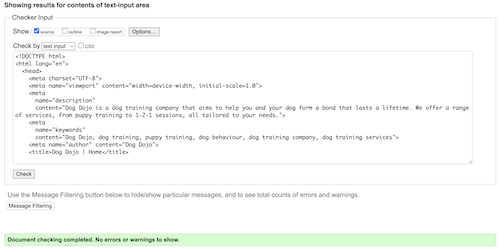

Errors:
1. Button element nested within an a element
    - Fixed by using bootstrap button classes within the a element and removing the button element
2. Repeated ID on trainer images
    - Fixed by changing the ID for class 

Warnings:
1. Name attributes on social media links suggested as obscelete
    - Fixed by removing name attribute and replacing with ID

Info:
1. Trailing slashes on void elements due to formating within html document
    - Removed all trailing slashes on void elements after final formatting

What we offer

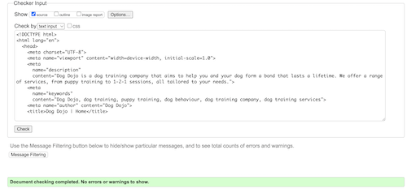

Errors:
1. Repeated ID on curriculum icons
    - Fixed by changing ID for class
2. Button element nested within an a element
    - Fixed by using bootstrap button classes within the a element and removing the button element

Warnings:
1. No warnings

Info:
1. Trailing slashes on void elements due to formating within html document
    - Removed all trailing slashes on void elements after final formatting

Events

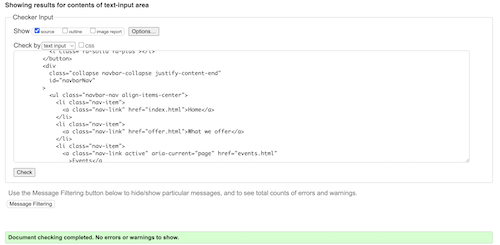

Errors:
1. Button element nested within a element
    - Fixed by using bootstrap button classes within the a element and removing the button element

Warnings:
1. No warnings

Info:
1. Trailing slashes on void elements due to formating within html document
    - Removed all trailing slashes on void elements after final formatting

Contact

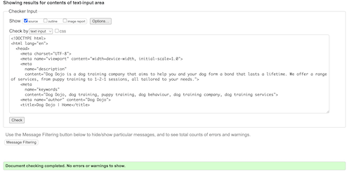

Errors:
1. No errors

Warnings:
1. No warnings

Info:
1. Trailing slashes on void elements due to formating within html document
    - Removed all trailing slashes on void elements after final formatting

### CSS validator

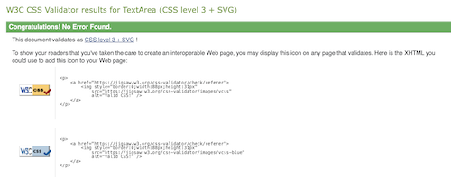

No errors arose from testing

### Lighthouse

Homepage

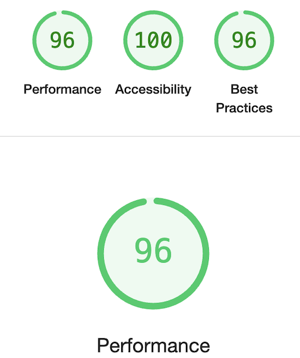

What we offer

Events

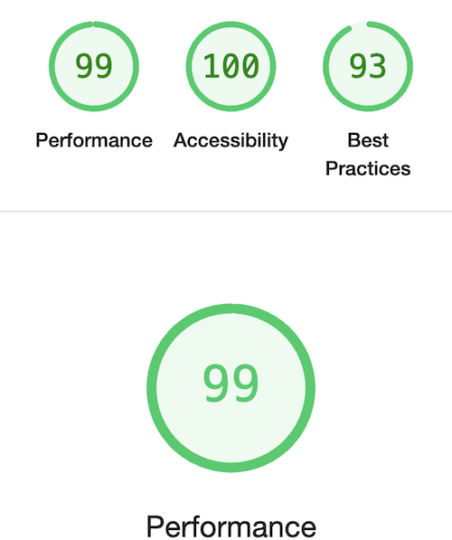

Contact

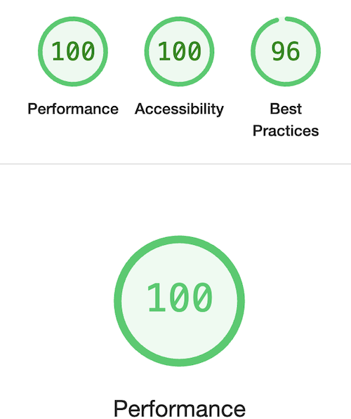

Issues:

Initially when I ran lighthouse on pages with images the loading times were too long due to improperly sized images. I resized and compressed these images until the performance scores were good. I also changed format of my larger images in jpeg or png form so they were in webp which also improved loading speeds.

Contrast of colours also flagged up and so I darkened the secondary text colour so that it met accessibility requirements whilst still maintaining the quality of my website.

## Technologies used

### Languages

I used HTML and CSS in order to complete this project 

### Technology

Github and Visual Studio 

## Credits and References

In order to build the website I used the following sources:
- Bootstrap
    - Used bootstrap grid system as well as documentation from bootstrap to design the navigation bar and carousel. These are documented within comments in the code. Bootstrap button classes are also included within button elements for ease of styling but have been customised accordingly for the website
- Unsplash.com for free images seen throughout the website
- AI generated icons using Microsoft Designer 
- Favicon for small icons used in footer
- Google fonts used for primary and secondary fonts throughout site

