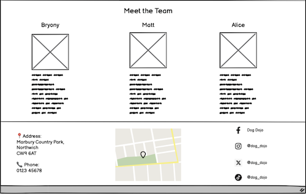

# Dog Dojo
Milestone Project 1 - Alice Phipps

[Github link](https://github.com/AP071216/mp1)

## Dog Dojo

This project designs and produces a website for a dog training business that provides information on the trainers, classes and events offered and opportunity to book with and contact the business. The website uses a simple colour pallete based on teal and coral which provide a clean appearance whilst also promoting a fun aspect. The fonts are simple and easy to read to not distract from the content.

### About Dog Dojo

"Dog Dojo" is a dog training business in Cheshire created by a dog lover and trainer with the aim to share knowledge and endorse positive relationships between dogs and their owners. It offers a 6 week puppy course as well as 1-2-1 sessions for behavioural issues and extra training. The business also hosts regular and one off events.

They required a simple website with easy navigation with a page displaying what they offered as a business and easy methods of booking and contact.

## Table of Contents

1. [UX](#ux)
    - [User Stories](#user-stories)
    - [Dog Owners](#dog-owners)
2. [Design](#design)
    - [Colours](#colours)
    - [Fonts](#fonts)
    - [Icons](#icons)
3. [Wireframes](#wireframes)
    - [Homepage - Desktop](#homepage---desktop)
    - [Homepage - Mobile](#homepage---mobile)
    - [What we offer - Desktop](#what-we-offer-page---desktop)
    - [What we offer - Mobile](#what-we-offer-page---mobile)
4. [Deployment](#deployment)
    - [Repository](#repository)
    - [Hosting](#hosting)

## UX

### User Stories

Primary goal of Dog Dojo is to provide a fun alternative to at home training and to improve socialisation of dogs in a safe and entertaining environment for both dogs and owners. Target audience is for owners of both puppies and dogs

### Dog owners

As a dog owner, I want:
1. The ability to easily book onto training class, 1-2-1 session or event so I can enhance my knowledge of owning a dog 
2. To view a basic curriculum for the course so I can confirm it aligns with my personal goals
3. Photos from the course to get a good view of the venue and types of dogs that have enrolled previously 
4. Information on the trainers that run the courses and events so that I can be confident that I’m receiving the best possible training
5. A clear navigation system through the site with links 
6. A schedule of regular events and upcoming one-off events so I can view which I’d like to attend
7. A contact section to easily ask for advice on behavioural issues that don’t require a 1-2-1 session to correct

## Design

The website is comprised of 4 pages comprising of, Home, What we offer, Events, and Contact. This provides clear separation of information with an added "booking" link in the navbar for quick access to the booking form on the "what we offer" page. 

Each page has easy access back to the home page or another page the user finds important

### Colours

### Fonts

- Primary font “Comfortaa” is an easy to read font whilst giving a more unique feel for headings and key text
- Secondary font “Baloo Bhaijaan 2” is also easy to read and a slightly more compact nature for content whilst keeping things clear

### Icons

Icons chosen for their clear representative meaning replacing text for a more modern look

## Wireframes

### Homepage - Desktop

### Homepage - Mobile

### What we offer page - Desktop
 

### What we offer page - Mobile

## Deployment

Github and Visual Studio are used to deploy the project

### Repository

1. Intially I created a public repository on my Github account and copied this to my repository on Visual Studio using the following commands
    - git config --global user.name (add username)
    - git config --global user.email (add email)
    - git config --list
2. Throughout my work on the project, I regularly committed my work to github using the following commands
    - git add .
    - git commit -m "Helpful and consise message regarding what had been changed"
3. After several commits were made, I then pushed my work to Github using:
    - git push

### Hosting
1. On conception of the project and having completed a basic boilerplate for my work, I went onto my project repository on github to set up for deployment
2. I went into Settings > Pages and ensured that "Deploy from a branch" was selected the main branch was the branch chosen then pressed save and waited for deployment

